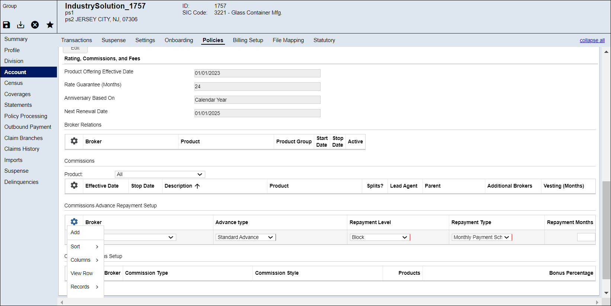

# **Add Advance Repayment Commissions**
Adding advance repayment commissions in Vlocity CoreAdmin involves several steps, including setting up the necessary prerequisites, configuring the system, and managing repayments. Below is a step-by-step guide to help you through the process.

## **Prerequisities**
1. **User Access and Permissions**

    * Ensure you have the necessary permissions to configure commission settings in Vlocity CoreAdmin.
    * User roles should include access to commission management modules.

2. **Product and Agent Setup**

    * Products and policies for which commissions are being advanced should be properly configured in the system.
    * Agents and brokers who will receive advance commissions must be set up in the system with their profiles and relevant details.

3. **Commission Plans**

    * Define and configure commission plans that outline the structure and rates of commissions.
    * Ensure that commission plans are linked to the appropriate products and agents.

4. **Financial Accounts**

    * Set up financial accounts and ensure that they are integrated with the commission management module for processing payments and recoveries.

## **Procedure**
The following demonstrates the step-by-step process for adding Advance Repayment Commissions in v3locity coreadmin application.

1. Log in to Vlocity CoreAdmin.
2. Go to the World section from the main dashboard page.
3. In the **World Search**, locate the **Group** you want. The **Profile** page appears.
4. Go to the **Account > Policies** tab.
5. In the **Commissions Advance Repayment Setup** section, select **grid Actions > Add**. A new row appears in the grid.
6. Fill in the details as mentioned in the below table:

    | Fields | Description | Characteristics |
    | --- | --- | --- |
    |Broker |This dropdown identifies and displays the Broker name and Broker Account ID of Brokers assigned to the policy. You can select the Broker you want from the list. | **Field Input**: User Defined   **Required**: No   **Downstream Impact**: N/A |
    |Advance type | This dropdown allows you to select the advance types.   **Valid Values**:  *Standard Advance*  *Off Cycle Payment* | **Field Input**: User Defined   **Required**: Yes   **Downstream Impact**: N/A |
    |Repayment Level  | This dropdown allows you to select the repayment level options that specifies the repayment level you want to apply for the commission.    **Valid Values**:  *Block*  *Group*  *Policy*  *Product*   *Renewal Period*| **Field Input**: User Defined   **Required**: Yes   **Downstream Impact**: N/A |
    |Repayment Type  | This dropdown allows you to select the different repayment options.    **Valid Values**:  *Whole Amount*  *Monthly Payment Schedule*  *Funds from Group* | **Field Input**: User Defined   **Required**: Yes   **Downstream Impact**: N/A |
    |Repayment Months  | This field appears when the Repayment Type is set as Monthly Payment Schedule. You can enter the number of months you want in the field. | **Field Input**: User Defined   **Required**: No   **Downstream Impact**: N/A |

    

7. Click **Save**.

!!! note "Note"
    Use the **Actions > Delete** option to delete the commission record which are not required.
