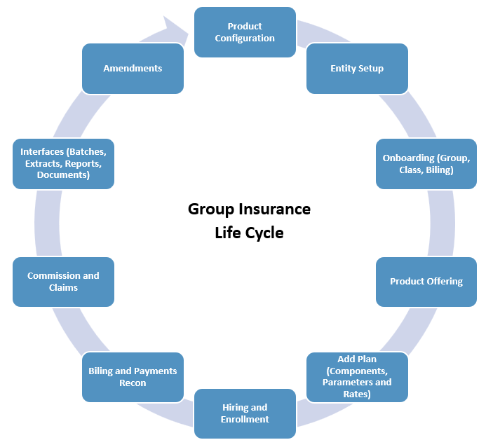

# Understand Group Insurance
Group life insurance is a type of insurance policy that an employer offers to its employees or members of a group. When employees elect coverage through the group policy, they are typically issued a certificate of coverage. If employees choose to take more advanced coverage options, they may have their portion of the premium payment deducted from their paycheck.

It is important to note that coverage under a group life insurance policy is only valid for as long as the member is part of the group. If the member leaves the group, whether through resignation or termination, the coverage ends.

## Group insurance life cycle

The following describes the standard Group Insurance Life Cycle in V3locity:

**Product Configuration**

You can create the packaged product in product configurations by defining the rules, calculations, benefit components, rates, billing, attributes, etc. through Product Setup and Plan Setup.

**Entity Setup**

Configure the entity by defining a new group in World.

**Onboarding**

Also known as case implementation where you onboard an employer as a Group entity through World and define the following:

* Profile, Division, Account, Class, Billing Group

* Define Components, Rating structure

* Link Class and Billing Group

**Product Offering** 

Allows you to add a product to the group. Based on the requirement, you can have one product or have all 13 products assigned to the Group.

**Add Plan** 

Add plan(s) to each product as per the requirement. Once the plan is configured, activate the plan.

!!! note "Note"

    Once the plan is in Active status, any changes will only be made through Amendments.

**Hiring and Enrollment** 

This is where you hire a member under Census or Roster and add coverage for member and their dependents. A member is hired first and then enrolled in a plan in the following ways:

* Directly adding to the roster and then continuing the process to coverage, or

* Hire a member and keep them in the waiting period. You can enroll the hired member during or once the waiting period is complete.

    !!! note "Note"
        Waiting Period is 31 days. 

**Billing and Payments Reconciliation**

For all the members enrolled, the billing process comprises the following:

* Generating and regenerating an invoice, Rebill and Payments
* Invoices are generated at the Group or Division (location) level
* These levels are defined under Billing Setup before activating a plan

    !!! note "Note"
        Billing intervals can be monthly, biweekly, first friday, etc.

**Commissions and Claims**

These are two distinct functionalities within the system. You can use Commissions at the broker setup level to set up and calculate commissions, while also designating brokers. On the other hand, Claims are used for managing incidents, processing claim line items, making claim payments and creating adjustments.

**Interfaces**

These are products that have out-of-the-box reports, extracts, batches and documents. You can add more batches, customized reports, extracts and documents.

**Amendments**

Amendments also known as **Policy Versioning**. To modify an existing Active Plan with active enrollments, you need to go through the Amendments process. The modifications to the plan may include changes to the rating structure, welcome letters, termination templates, etc. 

After an amendment has been made, it is necessary to reactivate the plan to run the required batches that will update the changes made to already enrolled members.

## Key offerings
V3locity Group Insurance offers the following functions:

* **Plan Admin**: Covers a variety of setup handled by Vitech to create the Products and Plan elections an insurance company offers in terms of insurance, covering, but not limited to, rates, enrollment rules, services covered and onboarding.

* **Member Admin**: Covers employee records, profile information such as a home address, employment records and inclusive of the insurance that the employee is elected into and any dependents on the employee coverage. 

* **Claims Admin**: Covers information on submitting an Insurance claim. Additionally, it includes the line items detail, service provider, adjustment and configured rules that determine the claim pay-out.

* **Commissions**: Covers the broker setup, agreements per commission, commission processing, broker bonuses, advances, retro payments and adjustments.

## Different categories offered
V3locity offers the Group Insurance as per the following categories:

| Product      | Description                          |
| ----------- | ------------------------------------ |
| Accident (ACC) |An insurance policy that offers a payout when people experience injury or death due to an accident. |
| Hospital Indemnity (HI) |Policy designed to pay for the costs of hospital admission; employees who are admitted to a hospital or ICU for a covered sickness or injury. |
| Critical Illness (CI)    | A policy that pays a direct lump-sum benefit for expenses that provides additional coverage for medical emergencies such as heart attacks, strokes or cancer, etc. |
|Accidental Death and Dismemberment (AD & D) | Provides coverage for death due to an accident and also pays if you lose a limb or a function such as sight, hearing or speech in an accident. |
|Life | In exchange for your premium payments, the insurance company pays a lump sum known as a death benefit to your beneficiaries after your death. |
|Life and AD & D | Combination of Life and AD & D where AD & D can be added as a rider to a Life policy. |
|Long Term Disability (LTD) | An insurance policy that protects an employee from loss of income in the event that he or she is unable to work due to illness, injury or accident for a long period of time. |
|Short Term Disability (STD) | Protects an employee from loss of income in the case that he or she is temporarily unable to work due to illness, injury or accident. |
|Administrative Services Only (ASO)_STD | A plan structure in which a company funds its own employee benefit plan. |
|Massachusetts Paid Family and Medical Leave (MPFML) | The Paid Family Leave for State of Massachusetts. |
|Hawaii Temporary Disability Insurance (HITDI) | Requires employers to provide partial wage replacement insurance coverage to their eligible employees for non work-related injury or sickness, including pregnancy. |
|Absence Management (AM) | Services help plan, track and handle employee leaves for employers, including administration, compliance with federal and state leave laws, claims management, return-to-work support and reporting. |
|Paid Family Leave (PFL) | Provides benefit payments to people who need to take time off work to care for their family such as seriously ill family member or bond with a new child. |