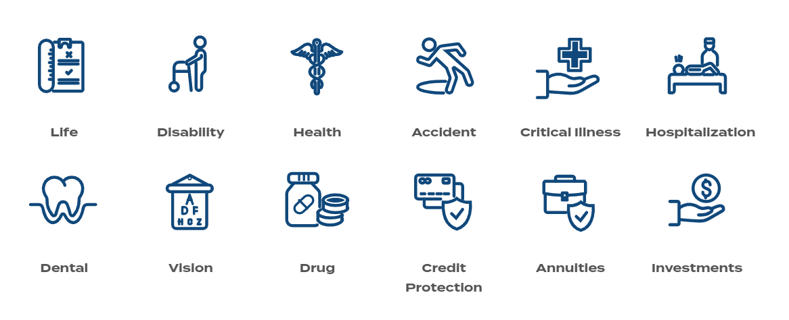
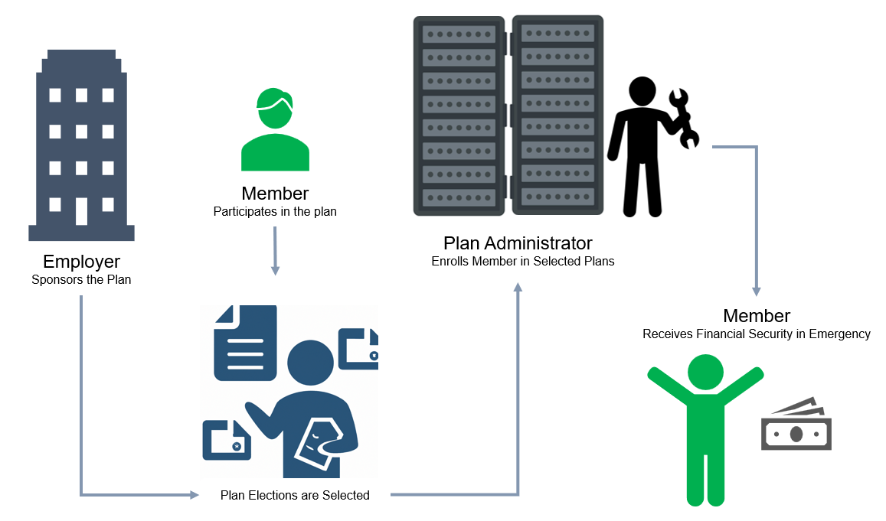

# Understand Insurance
Insurance is a financial product that provides protection against the risk of financial loss. Individuals use insurance as a means to mitigate their exposure to risk. Risk denotes the possibility of suffering a loss, which is typically unpredictable in terms of the timing and extent of the damage it may inflict on one's finances, health and family. In exchange for payment of a premium, an insurance company agrees to pay out a predetermined amount of money if a specified event occurs, such as damage to property, loss of income, injury or illness.

## V3locity for Insurance
V3locity is a cloud-based insurance platform designed to provide insurance companies with a comprehensive suite of tools for managing their insurance policies and claims. The platform offers a range of capabilities that enable insurers to streamline their operations, improve their customer service and increase their efficiency.

One of the key features of V3locity is its policy administration capabilities. The platform enables insurers to manage their policies, including policy setup, underwriting, policy issuance and renewal. 

The following are the product lines covered by V3locity:

### Key V3locity offerings
V3locity offers the following for insurers:

* **Quoting & Rating**: Providing an estimated price for coverage in the selected products by the group.

* **Case Implementation**: The process of putting a sold contract into effect.

* **Enrollment**: Signing up or registering for benefit coverage.

* **Policy Administration**: Ongoing maintenance of a groups case or members coverage.

* **Premium Billing**: Generating and sending invoices to customers for benefit coverage.

* **Payment Reconciliation**: Ensuring that the amount owed on an account matches the value paid.

* **Commissions**: Providing a broker with compensation in return for the sale of business.

* **Claims Processing**: Submitting a request for payment to an insurance company based on the term of the policy.

## Insurance sequence flow
The following diagram demonstrates the sequence flow of Insurance plan.

## Different types of insurance
**Individual insurance**

Individual insurance policy is purchased by an individual to provide coverage for themselves or their family members. An individual can purchase insurance coverage for a variety of risks such as health, life, disability, long-term care etc.

**[Group insurance](group_insurance.md)**

Group Insurance is offered by an employer or other organization to a group of individuals. The coverage is provided to all eligible members of the group, which can include employees of a company or members of a professional or trade association. The premiums for group insurance policies are often shared between the employer or organization and the individual members. One of the primary advantages of group insurance is that it is often less expensive than individual insurance, as the group as a whole can benefit from lower premiums due to the larger number of individuals being covered. 

**Voluntary benefits**

Voluntary Benefits are additional insurance products or services that are offered by an employer to employees as an optional supplement to their core employee benefits package. These benefits are typically not paid for by the employer but are paid for by the employee through payroll deductions and are designed to provide additional protection to employees and their families and can be customized to meet the specific needs of each individual. These include a variety of insurance products such as life insurance, disability insurance, critical illness insurance, accident insurance, and other specialty products.
