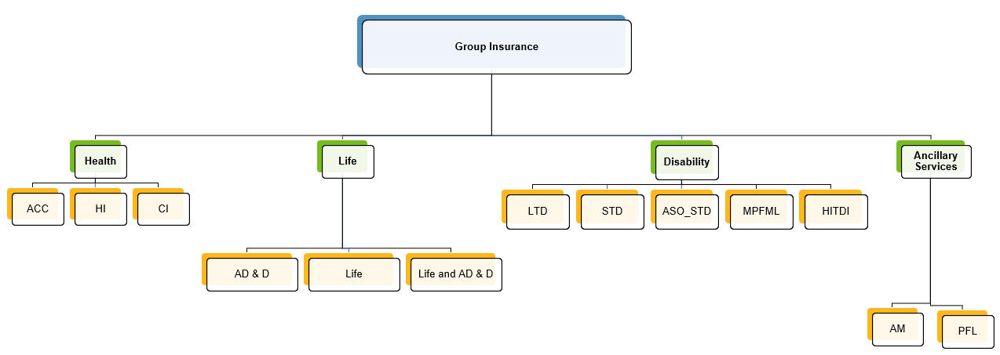

# Group Insurance
Group life insurance is a type of insurance policy that an employer offers to its employees or members of a group. When employees elect coverage through the group policy, they are typically issued a certificate of coverage. If employees choose to take more advanced coverage options, they may have their portion of the premium payment deducted from their paycheck.

It is important to note that coverage under a group life insurance policy is only valid for as long as the member is part of the group. If the member leaves the group, whether through resignation or termination, the coverage ends.

It is important to note that coverage under a group life insurance policy is only valid for as long as the member is part of the group. If the member leaves the group, whether through resignation or termination, the coverage ends.
 
## Product Category
V3locity offers the Group Insurance as per the following categories:

## Key functions of Insurance
V3locity Group Insurance offers the following functions:

* **Plan Admin**: Covers a variety of setup handled by Vitech to create the Products and Plan elections an insurance company offers in terms of insurance, covering, but not limited to, rates, enrollment rules, services covered and onboarding.

* **Member Admin**: Covers employee records, profile information such as a home address, employment records and inclusive of the insurance that the employee is elected into and any dependents on the employee coverage. 

* **Claims Admin**: Covers information on submitting an Insurance claim. Additionally, it includes the line items detail, service provider, adjustment and configured rules that determine the claim pay-out.

* **Commissions**: Covers the broker setup, agreements per commission, commission processing, broker bonuses, advances, retro payments and adjustments.
