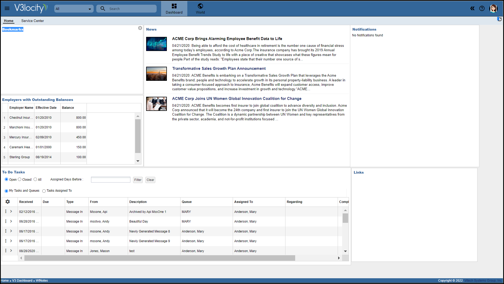
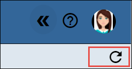
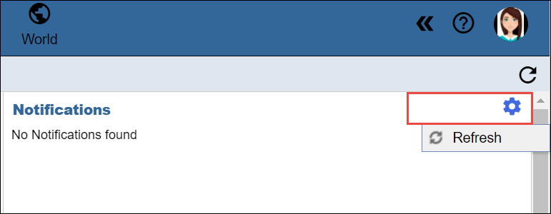

# About dashboard
The dashboard is the first screen that opens up after logging in to the V3locity application. The dashboard contains widgets and horizontal tabs configured for your organization and your assigned roles.

## View dashboard

Dashboard consists of widgets that gets updated each time you log in.

1. Click **Refresh All** icon to update all dashboard widgets during a session when needed.

2. Mouse over a widget, then click the **Actions > Refresh** action to update individual dashboard widgets when needed.
