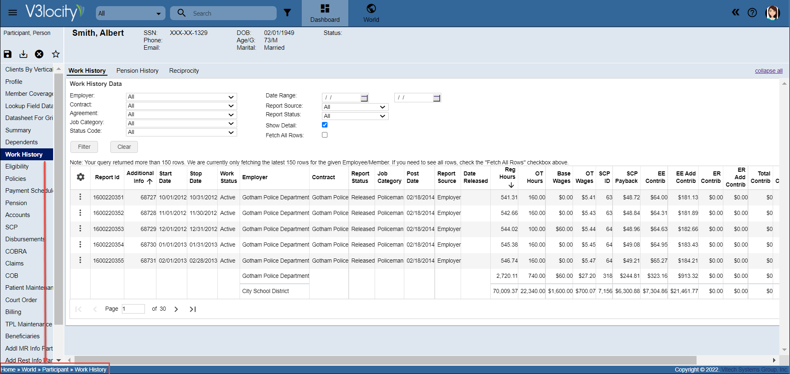

# Navigation path
The Navigation path displayed at the bottom of the page shows the menu path. Paths are typically written in the following format:

```
Menu > Sub-menu > Menu Item > Tab Name > Sub-tab Name
```

In World, the entity type (participant, employer, dependent, etc.) is included in the path. For example: 
```
Home > World > Participant > Work History
```
