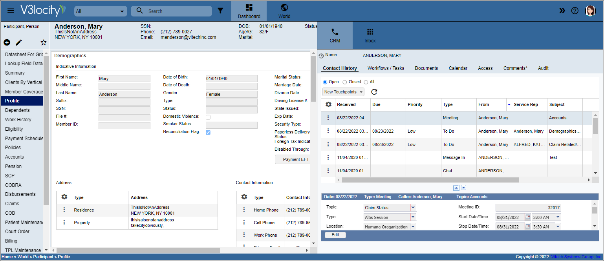

# About Customer Relations Management (CRM)
The Customer Relations Management (CRM) pages let CoreAdmin users create and view the interactions for an entity, access the workflows and documents of an entity, manage the Digital Experience access, view comments, and audit history.

!!! note "Note"

    1. Use the **Show/Hide Power Panel** icon to open the CRM windows.
    2. When the **Show Contextual CRM** feature is enabled via **User Profile > Settings**, the identifier of the child entity (such as a dependent name) displays on the header of the CRM window.

  [Twemoji]: https://twemoji.twitter.com/
  [emoji search]: ../reference/icons-emojis.md#search

## Tabs available 
CRM contains the following tabs:

1. Contact History: Log of interactions

2. Workflows or Tasks: List of workflows and tasks. See the V3locity Workflow Guide

3. Documents: List of incoming (images) and outgoing documents

4. alendar: Calendar of events for the entity, such as meetings and sessions

5. Access: Manage entity Digital Experience portal access

6. Comments: Add or review comments by topic

7. Audit: Review the audit history by category for changes made to the entity record